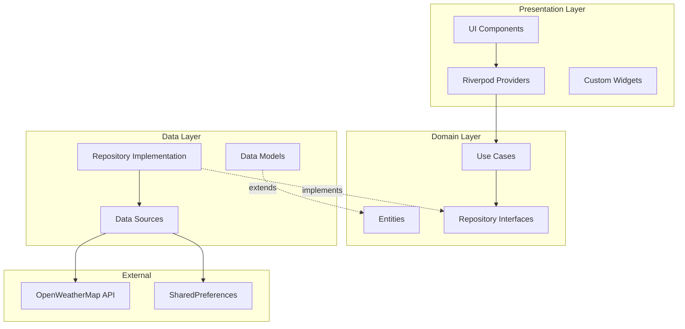
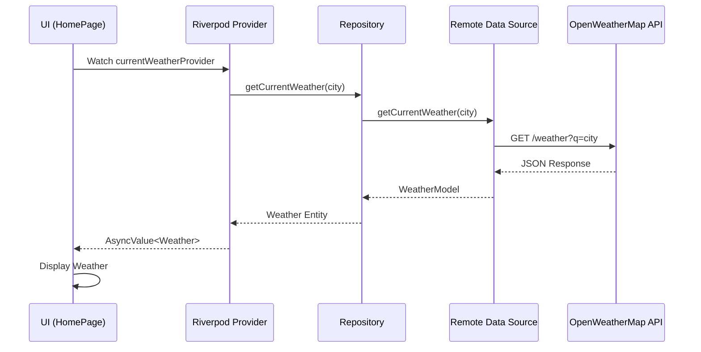
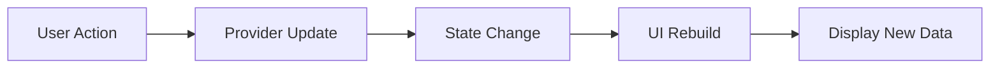
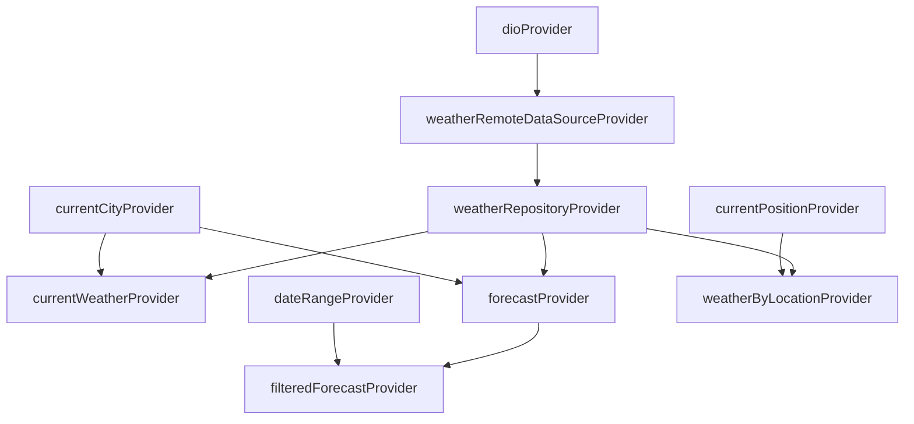
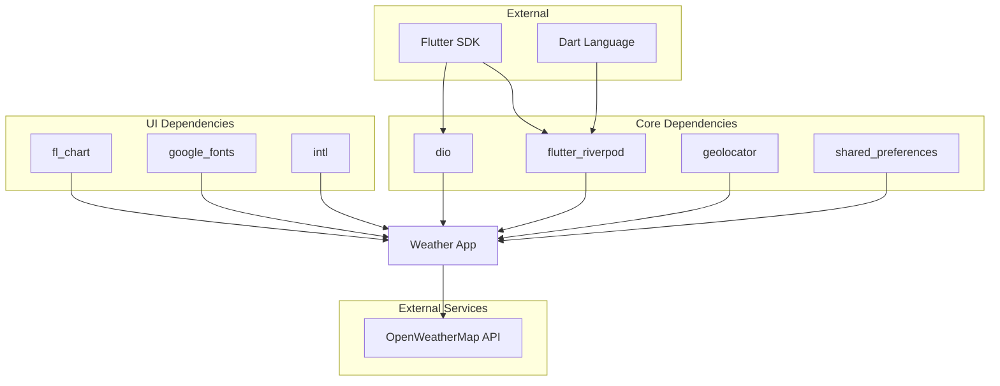

# Architecture Documentation

## Table of Contents

1. [Overview](#overview)
2. [Architecture Pattern](#architecture-pattern)
3. [Layer Structure](#layer-structure)
4. [Data Flow](#data-flow)
5. [State Management](#state-management)
6. [Dependency Graph](#dependency-graph)
7. [Design Decisions](#design-decisions)

---

## Overview

The Weather App is built using **Clean Architecture** principles, ensuring separation of concerns, testability, and maintainability. The architecture is designed to be scalable and follows Flutter best practices.

### Key Principles

- **Separation of Concerns**: Each layer has a single responsibility
- **Dependency Rule**: Dependencies point inward (toward the domain)
- **Independence**: Domain layer is independent of frameworks and UI
- **Testability**: Each layer can be tested in isolation

---

## Architecture Pattern

### Clean Architecture Layers



---

## Layer Structure

### 1. Presentation Layer (UI)

**Responsibility**: Display data and handle user interactions

**Components**:

- **Pages**: Full-screen views (HomePage, ForecastPage, etc.)
- **Widgets**: Reusable UI components (CustomAppBar, DateRangeSelector)
- **Providers**: Riverpod state management

**Key Files**:

```
presentation/
├── pages/
│   ├── home_page.dart
│   ├── forecast_page.dart
│   ├── favorites_page.dart
│   ├── search_page.dart
│   ├── settings_page.dart
│   ├── weather_alerts_page.dart
│   ├── main_screen.dart
│   └── splash_screen.dart
├── providers/
│   └── weather_provider.dart
└── widgets/
    ├── custom_app_bar.dart
    ├── date_range_selector.dart
    └── region_selector.dart
```

**Dependencies**: Domain layer only (Use Cases, Entities)

---

### 2. Domain Layer (Business Logic)

**Responsibility**: Contains business rules and application logic

**Components**:

- **Entities**: Pure Dart classes representing business objects
- **Repository Interfaces**: Define contracts for data access
- **Use Cases**: Encapsulate business logic

**Key Files**:

```
domain/
├── entities/
│   └── weather.dart
└── repositories/
    └── weather_repository.dart
```

**Weather Entity**:

```dart
class Weather {
  final String cityName;
  final double temperature;
  final String description;
  final int humidity;
  final double windSpeed;
  final String iconCode;
  final DateTime date;

  // No external dependencies
}
```

**Dependencies**: None (completely independent)

---

### 3. Data Layer (Data Management)

**Responsibility**: Fetch and manage data from external sources

**Components**:

- **Repository Implementation**: Implements domain interfaces
- **Data Sources**: Remote (API) and Local (SharedPreferences)
- **Models**: Data transfer objects with JSON serialization

**Key Files**:

```
data/
├── datasources/
│   └── weather_remote_datasource.dart
├── models/
│   └── weather_model.dart
└── repositories/
    └── weather_repository_impl.dart
```

**Data Flow**:

```
API → RemoteDataSource → Model → Repository → Entity → UI
```

**Dependencies**: Domain layer (implements interfaces)

---

## Data Flow

### Fetching Weather Data



### State Updates



---

## State Management

### Riverpod Architecture

The app uses **Flutter Riverpod** for state management with multiple provider types:

#### 1. Provider (Dependency Injection)

```dart
final dioProvider = Provider<Dio>((ref) {
  return Dio();
});

final weatherRemoteDataSourceProvider = Provider<WeatherRemoteDataSource>((ref) {
  final dio = ref.watch(dioProvider);
  return WeatherRemoteDataSourceImpl(dio);
});
```

#### 2. FutureProvider (Async Data)

```dart
final currentWeatherProvider = FutureProvider<Weather>((ref) async {
  final city = ref.watch(currentCityProvider);
  final repository = ref.read(weatherRepositoryProvider);
  return await repository.getCurrentWeather(city);
});
```

#### 3. StateProvider (Simple State)

```dart
final currentCityProvider = StateProvider<String>((ref) => 'London');
final temperatureUnitProvider = StateProvider<TemperatureUnit>(
  (ref) => TemperatureUnit.celsius
);
final bottomNavIndexProvider = StateProvider<int>((ref) => 0);
```

#### 4. StateNotifierProvider (Complex State)

```dart
final favoritesProvider = StateNotifierProvider<FavoritesNotifier, List<String>>(
  (ref) => FavoritesNotifier()
);
```

### Provider Dependency Graph



---

## Dependency Graph

### Overall App Dependencies



---

## Design Decisions

### 1. Why Clean Architecture?

**Rationale**:

- **Testability**: Each layer can be tested independently
- **Maintainability**: Changes in one layer don't affect others
- **Scalability**: Easy to add new features
- **Independence**: UI and database can be changed without affecting business logic

**Benefits**:

- Domain layer has no Flutter dependencies
- Easy to mock dependencies for testing
- Clear separation of concerns

---

### 2. Why Riverpod?

**Rationale**:

- **Compile-time Safety**: Catches errors at compile time
- **Testability**: Easy to mock providers
- **Performance**: Optimized rebuilds
- **Modern**: Recommended by Flutter team

**Comparison with Alternatives**:

- **vs Provider**: Better type safety, easier testing
- **vs BLoC**: Less boilerplate, simpler learning curve
- **vs GetX**: Better testability, no global state

---

### 3. Why Dio?

**Rationale**:

- **Interceptors**: Easy to add auth, logging
- **Type Safety**: Better type checking
- **Features**: Built-in timeout, retry logic
- **Performance**: Faster than http package

---

### 4. Feature-Based vs Layer-Based Structure

**Choice**: Feature-based structure

**Rationale**:

- **Cohesion**: Related code stays together
- **Scalability**: Easy to add new features
- **Team Collaboration**: Different teams can work on different features
- **Modularity**: Features can be extracted into packages

**Structure**:

```
lib/
├── core/           # Shared utilities
└── features/       # Feature modules
    └── weather/    # Weather feature
        ├── data/
        ├── domain/
        └── presentation/
```

---

## API Integration

### OpenWeatherMap API Endpoints

#### 1. Current Weather

```
GET https://api.openweathermap.org/data/2.5/weather
Parameters:
  - q: City name
  - appid: API key
  - units: metric/imperial
```

#### 2. Forecast

```
GET https://api.openweathermap.org/data/2.5/forecast
Parameters:
  - q: City name
  - appid: API key
  - units: metric
```

#### 3. By Coordinates

```
GET https://api.openweathermap.org/data/2.5/weather
Parameters:
  - lat: Latitude
  - lon: Longitude
  - appid: API key
  - units: metric
```

### Error Handling

```dart
try {
  final weather = await repository.getCurrentWeather(city);
  return weather;
} on ServerException {
  return throw ServerFailure();
} on NetworkException {
  return throw NetworkFailure();
}
```

---

## Local Data Storage

### SharedPreferences Usage

**Stored Data**:

1. **Favorite Cities**: List<String>
2. **Temperature Unit**: String (celsius/fahrenheit)
3. **Selected Region**: String

**Implementation**:

```dart
final prefs = await SharedPreferences.getInstance();
await prefs.setStringList('favorites', favorites);
final favorites = prefs.getStringList('favorites') ?? [];
```

---

## Performance Considerations

### 1. State Management

- **Selective Rebuilds**: Only widgets watching changed providers rebuild
- **Provider Caching**: API responses cached until dependencies change

### 2. API Calls

- **Debouncing**: Search input debounced to reduce API calls
- **Lazy Loading**: Data fetched only when needed

### 3. UI Rendering

- **Const Constructors**: Widgets marked const where possible
- **ListView.builder**: Used for large lists (forecast items)
- **GridView.builder**: Used for favorites (responsive grid)

---

## Security Considerations

### 1. API Key Management

**Current**: Hardcoded (development only)
**Production**: Should use environment variables

```dart
const apiKey = String.fromEnvironment('WEATHER_API_KEY');
```

### 2. HTTPS

All API calls use HTTPS for secure communication

### 3. Permissions

- **Location**: Requested only when "Use My Location" is tapped
- **Internet**: Declared in AndroidManifest.xml

---

## Testing Strategy

### 1. Unit Tests

- Test business logic (temperature conversion)
- Test models (JSON parsing)
- Test providers (state changes)

### 2. Widget Tests

- Test UI components render correctly
- Test user interactions
- Test loading/error states

### 3. Integration Tests

- Test API calls
- Test data flow through layers
- Test navigation

---

## Future Improvements

### 1. Caching

- Implement cache layer to reduce API calls
- Use Hive or SQLite for local caching

### 2. Offline Support

- Cache weather data for offline viewing
- Queue failed requests for retry

### 3. Background Updates

- Use WorkManager for periodic weather updates
- Push notifications for weather alerts

### 4. Analytics

- Add Firebase Analytics
- Track user behavior and feature usage

---

## Conclusion

The Weather App architecture is designed with:

- ✅ **Clean Architecture** for maintainability
- ✅ **Riverpod** for robust state management
- ✅ **Feature-based structure** for scalability
- ✅ **Clear separation of concerns**
- ✅ **Testability** at every layer

This architecture ensures the app is:

- Easy to maintain
- Easy to test
- Easy to extend
- Production-ready

---

**Last Updated**: November 30, 2024  
**Author**: Development Team  
**Version**: 1.0.0
