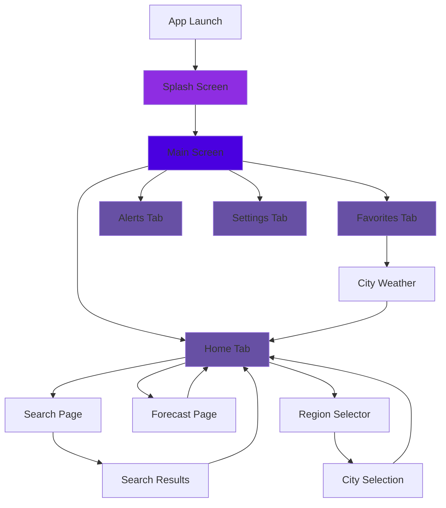
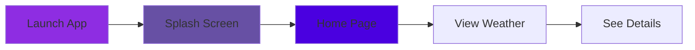
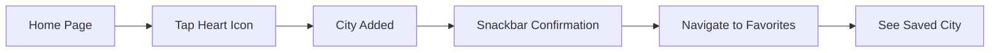
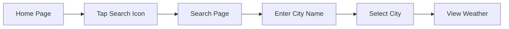
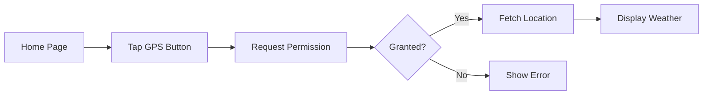
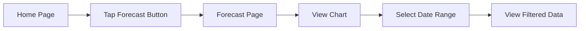

# Weather App Wireframes & UI Flow

## Table of Contents

1. [App Navigation Flow](#app-navigation-flow)
2. [Screen Wireframes](#screen-wireframes)
3. [User Flows](#user-flows)
4. [UI Components](#ui-components)

---

## App Navigation Flow

### Main Navigation Structure



---

## Screen Wireframes

### 1. Splash Screen

```
┌─────────────────────────────────┐
│                                 │
│         [Logo Animation]        │
│              ☀️                  │
│                                 │
│         Weather App             │
│   Your Weather Companion        │
│                                 │
│         [Loading...]            │
│                                 │
└─────────────────────────────────┘
```

**Features**:

- Animated logo with elastic bounce
- Gradient background (Purple → Violet)
- Auto-transition after 3 seconds

---

### 2. Home Page (Weather Tab)

```
┌─────────────────────────────────┐
│ ☁️  Weather    🌍  🔍  🔔      │ ← AppBar
├─────────────────────────────────┤
│                                 │
│         📍 London               │
│      Saturday, Nov 30           │
│                                 │
│           ☁️                    │
│           22°C                  │
│        Cloudy Sky               │
│                                 │
│  ┌──────────┐  ┌──────────┐   │
│  │ 💧 72%   │  │ 💨 15km/h│   │
│  │ Humidity │  │   Wind   │   │
│  └──────────┘  └──────────┘   │
│                                 │
│  [📍 Use My Location]          │
│                                 │
│  [📅 View 5-Day Forecast]      │
│                                 │
│                            ❤️   │ ← FAB (Favorite)
└─────────────────────────────────┘
│ ☁️ Weather │ ❤️ Favorites │ ⚠️ Alerts │ ⚙️ Settings │
└─────────────────────────────────┘
```

**Key Elements**:

- Top: City name, date
- Center: Weather icon, temperature, description
- Cards: Humidity and wind speed
- Buttons: GPS location, forecast
- FAB: Toggle favorite
- Bottom: Navigation bar

---

### 3. Forecast Page

```
┌─────────────────────────────────┐
│ ← 📅 London Forecast      🔔   │ ← AppBar
├─────────────────────────────────┤
│ Date Range Selector:            │
│ [1 Day] [7 Days] [1 Month] [Custom] │
├─────────────────────────────────┤
│ Temperature Trend               │
│                                 │
│   [Line Chart]                  │
│     📈                          │
│                                 │
├─────────────────────────────────┤
│ Forecast Details                │
│                                 │
│ ┌───────────────────────────┐  │
│ │ ☁️ Mon, Dec 1 • 2:00 PM  │  │
│ │    Cloudy                 │  │
│ │                   22.5°C  │  │
│ └───────────────────────────┘  │
│                                 │
│ ┌───────────────────────────┐  │
│ │ 🌧️ Mon, Dec 1 • 5:00 PM  │  │
│ │    Light Rain             │  │
│ │                   20.1°C  │  │
│ └───────────────────────────┘  │
│                                 │
└─────────────────────────────────┘
```

**Features**:

- Date range selector chips
- Interactive line chart
- Scrollable forecast list
- Weather icons from API

---

### 4. Favorites Page

```
┌─────────────────────────────────┐
│ ❤️ Favorite Cities        🔔   │ ← AppBar
├─────────────────────────────────┤
│                                 │
│  ┌──────────┐  ┌──────────┐   │
│  │   🏙️     │  │   🏙️     │   │
│  │  London  │  │ New York │   │
│  │    ❤️    │  │    ❤️    │   │
│  └──────────┘  └──────────┘   │
│                                 │
│  ┌──────────┐  ┌──────────┐   │
│  │   🏙️     │  │   🏙️     │   │
│  │  Tokyo   │  │  Paris   │   │
│  │    ❤️    │  │    ❤️    │   │
│  └──────────┘  └──────────┘   │
│                                 │
│  Swipe left to delete →        │
│                                 │
└─────────────────────────────────┘
│ ☁️ Weather │ ❤️ Favorites │ ⚠️ Alerts │ ⚙️ Settings │
└─────────────────────────────────┘
```

**Features**:

- Responsive grid (2 cols mobile, 3 cols tablet)
- Glassmorphism cards
- Tap to select city
- Swipe to delete
- Empty state with message

---

### 5. Search Page

```
┌─────────────────────────────────┐
│ ← 🔍 Search City          🔔   │ ← AppBar
├─────────────────────────────────┤
│                                 │
│  ┌─────────────────────────┐   │
│  │ 🔍 Enter city name...   │   │
│  └─────────────────────────┘   │
│                                 │
│  Popular Cities:                │
│                                 │
│  [London] [Paris] [Tokyo]       │
│  [New York] [Sydney]            │
│  [Mumbai] [Dubai] [Berlin]      │
│                                 │
│                                 │
└─────────────────────────────────┘
```

**Features**:

- Search input field
- Popular city chips
- Region filtering
- Auto-complete (future)

---

### 6. Weather Alerts Page

```
┌─────────────────────────────────┐
│ ⚠️ Weather Alerts         🔔   │ ← AppBar
├─────────────────────────────────┤
│                                 │
│  ┌────────────────────────────┐│
│  │ ⚠️ Severe Weather Warning  ││
│  │ Heavy Rain Expected        ││
│  │ Tomorrow 2:00 PM - 6:00 PM ││
│  └────────────────────────────┘│
│                                 │
│  ┌────────────────────────────┐│
│  │ 🌡️ High Temperature Alert  ││
│  │ 35°C Expected              ││
│  │ Today 12:00 PM - 4:00 PM   ││
│  └────────────────────────────┘│
│                                 │
│  [View All Alerts]              │
│                                 │
└─────────────────────────────────┘
│ ☁️ Weather │ ❤️ Favorites │ ⚠️ Alerts │ ⚙️ Settings │
└─────────────────────────────────┘
```

**Features**:

- Alert cards with severity icons
- Time range display
- Empty state when no alerts

---

### 7. Settings Page

```
┌─────────────────────────────────┐
│ ⚙️ Settings               🔔   │ ← AppBar
├─────────────────────────────────┤
│                                 │
│  Temperature Unit               │
│  Celsius (°C)            [ON]   │
│                                 │
│  ─────────────────────────────  │
│                                 │
│  ℹ️ About                       │
│  Weather App v1.0.0             │
│                                 │
│                                 │
└─────────────────────────────────┘
│ ☁️ Weather │ ❤️ Favorites │ ⚠️ Alerts │ ⚙️ Settings │
└─────────────────────────────────┘
```

**Features**:

- Temperature unit toggle switch
- App version info
- Simple, clean layout

---

### 8. Region Selector (Modal)

```
┌─────────────────────────────────┐
│ 🌍 Select Region                │
│                     [✕]         │
├─────────────────────────────────┤
│                                 │
│  Regions:                       │
│  [Europe] [Asia] [Americas]     │
│  [Africa] [Oceania]             │
│                                 │
│  ─────────────────────────────  │
│                                 │
│  Popular Cities in Europe:      │
│                                 │
│  [London] [Paris] [Berlin]      │
│  [Rome] [Madrid] [Amsterdam]    │
│                                 │
└─────────────────────────────────┘
```

**Features**:

- Region chips
- City chips within selected region
- Modal bottom sheet
- Tap to select city

---

## User Flows

### Flow 1: Check Current Weather



**Steps**:

1. User launches app
2. Splash screen plays (3s)
3. Home page shows default city weather
4. User views temperature, humidity, wind

---

### Flow 2: Add City to Favorites



**Steps**:

1. User on home page
2. Taps heart FAB
3. City added to favorites
4. Confirmation snackbar
5. Navigate to Favorites tab
6. See city in grid

---

### Flow 3: Search for City



**Steps**:

1. User on home page
2. Taps search icon
3. Opens search page
4. Types city name or selects from popular
5. Weather updates on home

---

### Flow 4: Use GPS Location



**Steps**:

1. User taps "Use My Location"
2. App requests location permission
3. If granted, fetches coordinates
4. Updates weather for current location

---

### Flow 5: View Forecast



**Steps**:

1. User taps "View 5-Day Forecast"
2. Opens forecast page
3. Sees temperature chart
4. Can change date range
5. Scrolls through forecast list

---

## UI Components

### Component Library

#### 1. Custom App Bar

```
┌─────────────────────────────────┐
│ [Icon] Title       [🔔] [More] │
└─────────────────────────────────┘
```

- White background
- Page-specific icon (left)
- Notification icon (right)
- Centered title

#### 2. Weather Card

```
┌──────────────┐
│     ☁️       │
│    22°C      │
│   Cloudy     │
└──────────────┘
```

- Glassmorphism effect
- Blur background
- White text
- Rounded corners

#### 3. Info Card

```
┌──────────┐
│ 💧 72%   │
│ Humidity │
└──────────┘
```

- Glassmorphism
- Icon + value
- Label text

#### 4. City Chip

```
[🏙️ London]
```

- Rounded rectangle
- Tap to select
- Used in search, region selector

#### 5. Date Range Chip

```
[1 Day] [7 Days] [1 Month]
```

- Choice chips
- Selected state highlighted
- Filter trigger

---

## Responsive Design

### Breakpoints

| Device  | Width     | Grid Columns | Font Scale |
| ------- | --------- | ------------ | ---------- |
| Mobile  | <600px    | 2            | 1.0        |
| Tablet  | 600-900px | 3            | 1.1        |
| Desktop | >900px    | 4            | 1.2        |

### Adaptive Layouts

- **Favorites**: 2-column grid (mobile) → 3-column (tablet)
- **Forecast List**: Full width (mobile) → Cards (tablet)
- **Search**: Stack (mobile) → Grid (tablet)

---

## Color Scheme

### Primary Colors

- **Purple**: `#4A00E0`
- **Violet**: `#8E2DE2`
- **Deep Purple**: `#6750A4`

### UI Colors

- **White**: `#FFFFFF`
- **Black**: `#000000`
- **Glass**: `rgba(255, 255, 255, 0.15)`

### Gradients

- **Background**: Purple → Violet (top to bottom)
- **Cards**: White with 15% opacity + blur

---

## Typography

### Font Family

- **Primary**: Outfit (Google Fonts)

### Sizes

- **Display Large**: 32px (City name)
- **Display Medium**: 28px (Temperature)
- **Headline Small**: 24px (Section titles)
- **Body Large**: 16px (Normal text)
- **Body Medium**: 14px (Descriptions)
- **Label Small**: 12px (Captions)

---

## Icons

### System Icons

- **Weather**: ☁️ 🌧️ ⛈️ ❄️ ☀️
- **Navigation**: 🏠 ❤️ ⚠️ ⚙️
- **Actions**: 🔍 🔔 📍 ❌

### Weather Icons

- From OpenWeatherMap API
- Format: `https://openweathermap.org/img/wn/{iconCode}.png`

---

## Animations

### 1. Splash Screen

- **Logo**: Scale (0.5 → 1.0) with elastic curve
- **Text**: Slide up + fade in
- **Duration**: 2 seconds

### 2. Page Transitions

- **Type**: Fade + slide
- **Duration**: 300ms
- **Curve**: easeInOut

### 3. Card Interactions

- **Hover**: Scale (1.0 → 1.05)
- **Tap**: Ripple effect
- **Swipe**: Dismissible animation

---

## Accessibility

### WCAG Compliance

- ✅ Color contrast ratio: 4.5:1 minimum
- ✅ Touch targets: 48x48dp minimum
- ✅ Text scaling: Supports system font size
- ✅ Screen reader: All elements labeled

### Features

- Semantic labels on icons
- High contrast mode support
- Large touch targets
- Clear visual hierarchy

---

**Last Updated**: November 30, 2024  
**Designer**: Development Team  
**Version**: 1.0.0
